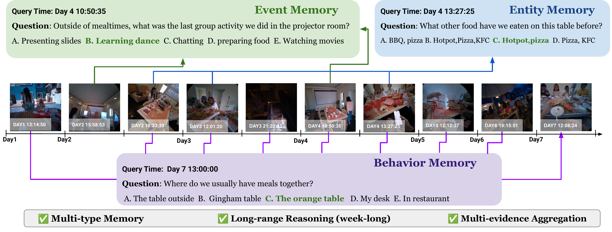

# EgoMemReason

**A Memory-driven Reasoning Benchmark for Long-Horizon Egocentric Video Understanding**

[Project page](https://egomemreason.github.io/) · [Paper](#) · [Benchmark (HF)](https://huggingface.co/datasets/Ted412/EgoMemReason) · [Leaderboard (HF Space)](https://huggingface.co/spaces/Ted412/EgoMemReason)

Ziyang Wang\*, Yue Zhang\*, Shoubin Yu, Ce Zhang, Zengqi Zhao, Jaehong Yoon, Hyunji Lee, Gedas Bertasius, Mohit Bansal
*UNC Chapel Hill · NTU Singapore* — *Equal contribution*

<p align="center">
  
</p>

---

## Overview

Next-generation visual assistants — smart glasses, embodied agents, always-on life-logging systems — must reason over an entire day or more of continuous visual experience. In ultra-long video, relevant information is **sparsely distributed across hours or days**, making memory the fundamental challenge: models must accumulate information over time, recall previously observed states, track temporal order, and abstract recurring patterns.

**EgoMemReason** is a comprehensive benchmark that systematically evaluates week-long egocentric video understanding through the lens of **memory-driven reasoning**. It targets three complementary memory types:

- **Entity memory** — track how object states evolve across days
- **Event memory** — recall and order activities separated by hours or days
- **Behavior memory** — abstract recurring patterns from sparse, repeated observations

500 multiple-choice questions across 6 core challenges, with **5.1 evidence segments / question** and **25.9 h memory backtracking** on average — 2× both metrics over the strongest prior week-long benchmark.

<p align="center">
  
</p>

## Main Results

We evaluate 17 systems spanning general-purpose MLLMs, video-specific MLLMs, and agentic video frameworks. The strongest model reaches **39.6%** overall — long-horizon memory is far from solved. Numbers are from the paper's Table 1; best in each column **bold**, second-best <u>underlined</u>.

| Method | Tracking | Counting | Ordering | Linking | Spatial | Activity | Overall |
|---|---:|---:|---:|---:|---:|---:|---:|
| Random | 19.6 | 16.7 | 11.1 | 17.3 | 19.3 | 19.2 | 16.8 |
| *General-purpose MLLMs* | | | | | | | |
| InternVL3.5-8B | 23.0 | 29.0 | 23.0 | 27.0 | 34.0 | 42.0 | 28.0 |
| Qwen-3-VL-8B | 35.0 | 28.0 | 23.0 | 21.0 | 40.0 | 42.0 | 29.6 |
| InternVL3.5-38B | 33.0 | 40.0 | 27.0 | 24.0 | 46.0 | 32.0 | 32.6 |
| Qwen-3-VL-30B-A3B | 36.0 | <u>48.0</u> | 25.0 | 26.0 | 40.0 | 30.0 | 34.0 |
| Qwen-3-VL-32B | 35.0 | 46.0 | 27.0 | 27.0 | **50.0** | <u>46.0</u> | 36.8 |
| GPT-5 | 29.0 | 42.0 | 20.0 | 18.0 | 32.0 | 28.0 | 27.8 |
| **Gemini-3-Flash** | **46.0** | 28.0 | <u>36.0</u> | **44.0** | 44.0 | 44.0 | **39.6** |
| Gemini-3.1-Pro | <u>40.0</u> | 26.0 | **44.0** | <u>33.0</u> | 40.0 | **48.0** | <u>37.4</u> |
| *Video-specific MLLMs* | | | | | | | |
| LongVA-7B | 22.0 | 18.0 | 20.0 | 20.0 | 20.0 | 22.0 | 20.6 |
| InternVideo2.5-8B | 29.0 | 27.0 | 25.0 | 15.0 | 32.0 | 32.0 | 25.6 |
| VideoLLaMA3-8B | 23.0 | 31.0 | 27.0 | 32.0 | 38.0 | 36.0 | 30.0 |
| Molmo2-8B | 36.0 | **50.0** | 27.0 | 25.0 | 34.0 | 22.0 | 33.2 |
| *Agentic video frameworks* | | | | | | | |
| SiLVR | 31.0 | 14.0 | 27.0 | 17.0 | 18.0 | 28.0 | 22.4 |
| Ego-R1 | 30.0 | 18.0 | 23.0 | 18.0 | <u>48.0</u> | 32.0 | 25.8 |
| WorldMM | 32.0 | 44.0 | 21.0 | 21.0 | 34.0 | 36.0 | 30.6 |
| **AVP (ours)** | 34.0 | 42.0 | 31.0 | 27.0 | 38.0 | 34.0 | 34.0 |

## Repository Layout

```
EgoMemReason/
├── data/                  # Dataset access instructions (see data/README.md)
├── evaluation/            # Per-model evaluation scripts (one folder per system)
│   ├── Gemini/            # Gemini-3 Flash / 3.1 Pro
│   ├── GPT5/              # GPT-5 (via Azure OpenAI)
│   ├── InternVL/          # InternVL3.5-8B / 38B
│   ├── InternVideo/       # InternVideo2.5-8B
│   ├── LongVA/            # LongVA-7B
│   ├── Molmo2/            # Molmo2-8B
│   ├── Qwen3VL/           # Qwen-3-VL 8B / 32B / 30B-A3B (+ ablations)
│   └── VideoLLaMA3/       # VideoLLaMA3-8B
└── agentic/               # Agentic video frameworks
    ├── AVP/               # Ours — Agentic Video Pipeline (Gemini backbone)
    ├── EgoR1/             # Ego-R1 reasoning agent
    ├── SILVR/             # SiLVR
    └── WorldMM/           # WorldMM retrieval + reasoning framework
```

Each method directory ships only the **scripts** for evaluation. The underlying model code (LongVA, VideoLLaMA3, Ego-R1-Agent, etc.) is *not* vendored — install each from its upstream repo, then point the run script at the right environment. See each subfolder's README for the exact upstream link and install snippet.

## Quick Start

### 1. Get the benchmark

The 500 questions are on Hugging Face: <https://huggingface.co/datasets/Ted412/EgoMemReason>

```bash
hf download Ted412/EgoMemReason annotations_public.jsonl --repo-type dataset --local-dir ./data
# Video frames come from EgoLife (separate license): https://egolife-ai.github.io/
# Then set:
export EGOMEM_DATA=/path/to/benchmark.json            # see data/README.md
export EGOLIFE_FRAMES_INDEX=/path/to/egolife_frames_index.json
```

See [`data/README.md`](data/README.md) for the full schema, the frame-index format, and how submissions are scored.

### 2. Run a method

Closed-source API models (Gemini, GPT-5) are the simplest:

```bash
cd evaluation/Gemini
export GOOGLE_API_KEY=...
INPUT_JSON=$EGOMEM_DATA \
FRAMES_INDEX=$EGOLIFE_FRAMES_INDEX \
bash run_final_benchmark_500_apr22_gemini_flash_512.sh 20   # 20 parallel jobs
```

Open-source MLLMs require the upstream environment first (see per-folder README), then:

```bash
cd evaluation/Qwen3VL
INPUT_JSON=$EGOMEM_DATA bash run_final_benchmark_500_apr22.sh
```

### 3. Score a run

Each `eval_*.py` writes a JSON file with one prediction per question. Per-task / overall accuracy is printed at the end of every run. Prediction shards from parallel jobs are merged by `merge_temporal_ordering_eval_shards.py` (under `evaluation/Gemini/` and `evaluation/GPT5/`).

### 4. Submit to the public leaderboard

Once you have a prediction file, submit it to the **EgoMemReason Leaderboard** to appear on the public ranking:

**→ https://huggingface.co/spaces/Ted412/EgoMemReason**

Convert any of the reference eval-script outputs to the submission format with a one-liner:

```python
import json
src = json.load(open("results_my_model.json"))
sub = [{"example_id": r["example_id"], "predicted_answer": r["pred"]} for r in src]
json.dump(sub, open("submission.json", "w"))
```

The Leaderboard accepts JSON with 500 entries; per-split scores against the held-out answer key are computed automatically. See the **Submit** tab on the Space for the full spec.

## Adding a New Method

1. Create `evaluation/<YourMethod>/` (or `agentic/<YourMethod>/`).
2. Implement an inference script that reads `final_benchmark_500_apr22.json` and writes `[{"id", "predicted_answer", "correct", ...}, ...]`.
3. Compare against the schema used by any existing method (e.g. `evaluation/Gemini/eval_gemini_frames.py` is a clean reference).
4. Report Tracking / Counting / Ordering / Linking / Spatial / Activity / Overall — splits are tagged in the dataset.

## Citation

```bibtex
@article{wang2026egomemreason,
  title   = {EgoMemReason: A Memory-driven Reasoning Benchmark for Long-Horizon Egocentric Video Understanding},
  author  = {Wang, Ziyang and Zhang, Yue and Yu, Shoubin and Zhang, Ce and Zhao, Zengqi and
             Yoon, Jaehong and Lee, Hyunji and Bertasius, Gedas and Bansal, Mohit},
  year    = {2026},
  journal = {arXiv preprint}
}
```

## License

Code in this repository is released under the MIT License (see `LICENSE`). The benchmark is built on top of [EgoLife](https://egolife-ai.github.io/) — please follow EgoLife's data license when using the underlying video frames.
